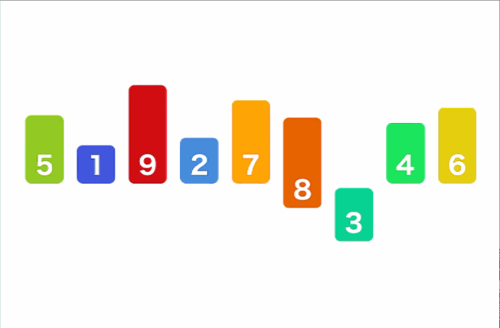
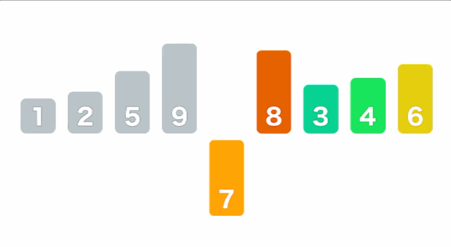

# 排序算法

1.  运行时间，性能

2.  额外的内存使用
    
    -   原地排序算法：除了函数调用所需的栈和固定数目的实例变量之外**无需额外内存**
    -   其他排序算法：需要额外内存空间来存储另一份数组副本
    
3.  接受任何可以比较的数据类型(泛型)


## 排序算法类模板

需要导入

```java
package Sort;

import java.util.Scanner;

/**
 *排序算法类的模板
 */
public class SortExample {
    public static void sort(Comparable[] a){
        //排序算法实现
    }
	// 返回较小的对象
    public static boolean less(Comparable v, Comparable w){
        //对元素进行比较
        return v.compareTo(w)<0;
    }

    public static void exch(Comparable[] a,int i,int j){
        //交换元素
        Comparable t=a[i];
        a[i]=a[j];
        a[j]=t;
    }

    public static void show(Comparable[] a){
        //在单行中打印数组
        for(int i=0;i<a.length;i++){
            System.out.print(a[i]+"");
            System.out.println();
        }
    }

    public static boolean isSorted(Comparable[] a){
        //测试数组元素是否有序
        for(int i=1;i<a.length;i++){
            if(less(a[i],a[i-1])){
                return false;
            }
        }
        return true;
    }

    public static  void main(String[] args){
        Scanner scanner=new Scanner(System.in);
        while (scanner.hasNext()){
            String line=scanner.nextLine();
            String[] a=line.split(" ");
            sort(a);
            assert isSorted(a);
            show(a);
        }


    }
}
```


## 选择排序

>   不断选择剩余元素之中的最小者(最大者)
>
>   找到数组的最小(最大)的元素，与数组第一个元素交换位置，然后再剩下的部分中找到最小(最大)的元素，与数组的第二个元素交换，往复，直到数组末尾

 

```java

import static Sort.SortExample.*;

// 选择排序
public class SelectSort {
    public static void sort(Comparable[] a){

        int N = a.length;
        for(int i = 0; i < N; i ++){
            int min = i;
            for(int j = i+1; j < N; j++)
                if(less(a[j], a[min]))   // 当 a[j] < a[min]时，为true  所以为从小到大排列
                    min = j;
            exch(a, i, min);   // 在数组a中交换索引为 i min 的数据
        }
    }
}
```


### 特点

*   运行时间与输入无关，与数组的有序性无关(对一个有序数组和无序数组，所用时间相同)

*   数据移动最少   N次交换

    

### 时间复杂度

$$
O(n^2)
$$


## 冒泡排序

>   通过两个索引对数组进行遍历，并比较交换，让数组的未排序部分的最小（最大）元素移动到右边（左边）


## 插入排序

>   始终保持索引左边有序，新加入的元素不断向左移动，插入到左侧有序部分

 

```java
import static Sort.SortExample.*;

public class insertSort {
    public static void sort(Comparable[] b){

        int N = a.length;
        for(int i = 0; i < N; i ++){
            // 循环时要保证当前索引数据小于左边的数据  否则终止循环
            for(int j = i; j > 0 && less(a[j], a[j-1]); j --)
                exch(a, j, j-1);
        }
    }
}
```

特点：

*   运行时间与数组的有序性有关，成正比

*   对于处理部分有序的数组很有效

    *   部分有序数组

        1.  数组中每个元素距离它的最终位置都不远
        2.  一个有序的大数组接一个小数组
        3.  数组中只有几个元素的位置不正确

        

### 时间复杂度

$$
N^2
$$


## 希尔排序

>   经过优化的插入排序

对于大规模的乱序数组普通的插入排序很慢，因为它只会交换相邻的元素，元素只能一点一点地移动

优化后，希尔排序可以交换不相邻的元素以对数组的局部进行排序，并最终用插入排序将局部有序的小数组排序

步骤：

1.  将大数组分成多个小数组，每隔 h-1 个元素为一个小数组
2.  对每个小数组进行插入排序
3.  缩小h 再进行小数组的插入排序
4.  继续缩小 h 直到h = 1 为普通的插入排序，即完成

```java
package Sort;

import java.util.Arrays;
import java.util.Random;

import static Sort.SortExample.*;
// 优化后的插入排序
public class ShellSort {
    public static void sort(Comparable[] b) {
        int n = a.length;
        int h = 1;
        while (h < n / 3)
            h = 3 * h + 1;

        System.out.println(Arrays.toString(a));
        while (h >= 1) {
            System.out.println("h 等于" + h);
            // 将数组排序
            for (int i = h; i < n; i++){
                for (int j = i; j >= h && less(a[j], a[j - h]); j -= h) {  
                    exch(a, j, j - h);
                }
            }
            h /= 3; // h 变化  当 h变为 1 时， 变为普通插入排序
            System.out.println(Arrays.toString(a));
        }
    }
}
```

特点：

*   比前两者都快，数组越大，优势越明显
*   运算时间小于  N^2
*   解决问题时，若系统内置排序函数不可用，首先尝试希尔排序

理解希尔排序：

```java
package Sort;

import java.util.Arrays;
import java.util.Random;

import static Sort.SortExample.*;
// 优化后的插入排序
public class ShellSort {
    public static void sort(Comparable[] b) {

        Comparable[] a = new Comparable[b.length];
        System.arraycopy(b, 0, a, 0, b.length);
        int n = a.length;
        int h = 1;
        while (h < n / 3)
            h = 3 * h + 1;
        
        System.out.println(Arrays.toString(a));
        while (h >= 1) {
            System.out.println("h 等于" + h);
            // 将数组排序
            for (int i = h; i < n; i++){  // i++ 进入下一个小数组的排序  每隔 h-1个元素为一个数组
                System.out.println("i 等于" + i);
                // 将 a[i] 插入到 a[i-h], a[i-2*h], a[i-3*h]  之中
                // 先进行判断 a[j-h] 是否大于 a[j]  若不是不交换
                for (int j = i; j >= h && less(a[j], a[j - h]); j -= h) {  // 保证这个小数组的有序性
                    System.out.println("要做交换的是：" + a[j - h] + ", " + a[j]);
                    exch(a, j, j - h);
                    System.out.println(Arrays.toString(a));
                }
            }

            h /= 3; // h 变化  当 h变为 1 时， 变为普通插入排序
            System.out.println(Arrays.toString(a));
        }
        if(!isSorted(a))
            System.out.println("希尔排序失败");
    }

    public static void main(String[] args) {
        Comparable[] test2 = new Comparable[10];
        Random random = new Random();
        for(int i = 0; i < 10; i ++)
            test2[i] = random.nextInt(100);
        sort(test2);
    }
}
```

输出为：

```
[11, 39, 27, 81, 57, 94, 66, 89, 53, 7]
h 等于4
要做交换的是：57, 53
[11, 39, 27, 81, 53, 94, 66, 89, 57, 7]
要做交换的是：94, 7
[11, 39, 27, 81, 53, 7, 66, 89, 57, 94]
要做交换的是：39, 7
[11, 7, 27, 81, 53, 39, 66, 89, 57, 94]
[11, 7, 27, 81, 53, 39, 66, 89, 57, 94]
h 等于1
要做交换的是：11, 7
[7, 11, 27, 81, 53, 39, 66, 89, 57, 94]
要做交换的是：81, 53
[7, 11, 27, 53, 81, 39, 66, 89, 57, 94]
要做交换的是：81, 39
[7, 11, 27, 53, 39, 81, 66, 89, 57, 94]
要做交换的是：53, 39
[7, 11, 27, 39, 53, 81, 66, 89, 57, 94]
要做交换的是：81, 66
[7, 11, 27, 39, 53, 66, 81, 89, 57, 94]
要做交换的是：89, 57
[7, 11, 27, 39, 53, 66, 81, 57, 89, 94]
要做交换的是：81, 57
[7, 11, 27, 39, 53, 66, 57, 81, 89, 94]
要做交换的是：66, 57
[7, 11, 27, 39, 53, 57, 66, 81, 89, 94]
[7, 11, 27, 39, 53, 57, 66, 81, 89, 94]
```

希尔排序在 实现h有序时，一定要使用插入排序

*   因为选择排序无法利用现有的有序性，当h=1时，无法利用现有的h有序性，对数组进行排序。
*   而插入排序最大的优点是可以利用现有的部分有序性


## 三种排序算法的比较

>   数据来源：algo4 官方提供的 algo4-data.zip 数据包

先进行1k数据量的比较：

```
选择排序，1000个数据，执行时间为：0.012673201 s
插入排序，1000个数据，执行时间为：0.0126063 s
希尔排序，1000个数据，执行时间为：0.0015172 s
```

进行32k数据量的比较：

```
选择排序，1000个数据，执行时间为：4.1962712 s
插入排序，1000个数据，执行时间为：2.6067247 s
希尔排序，1000个数据，执行时间为：0.027314501 s
```


## 归并排序

>   将两个有序的数组归并成一个更大的有序数组


一种简单的方法是：将两个数组归并到第三个数组中（需要额外的空间）

更常见的做法是：避免了开辟额外空间，采用原地归并的方式

### 原地归并的抽象方法

```java
    public static void merge(Comparable[] a, int lo, int mid, int hi){
        // 将大数组a分成两个小数组，a[lo, mid], a[mid, hi] 分别进行排序
        int j = mid+1;
        int i = lo;
        // 数组复制，复制到辅助数组中
        System.arraycopy(a, lo, aux, lo, hi);

        for(int k = lo; k <= hi; k++) {
            if (i > mid)             // 当左侧小数组为空时
                a[k] = aux[j++];
            else if (j > hi)        // 当右侧小数组为空时
                a[k] = aux[i++];
            // 比较左右两个数组首位，如果aux[j]小于aux[i]
            else if (less(aux[j], aux[i])) 
                // 将 aux[j] 放入原数组  并索引下移
                a[k] = aux[j++];            
            else  // 否则将 aux[i] 放入原数组  并索引下移
                a[k] = aux[i++];
        }
    }
```


### 自顶向下的归并排序

>   算法讲究先从上直接递归到最小数组，将最小数组排序

步骤：

1.  通过递归将数组不断二分，直到小数组只含有两个元素为止
2.  将只含有两个元素的数组排序后，再重新组成上层数组
3.  如此反复，直到大数组为止


```java
package Sort;

import java.util.Arrays;
import java.util.Random;

import static Sort.SortExample.isSorted;
import static Sort.SortExample.less;

public class MergeSort {

    public static Comparable[] aux;

    // 主函数，供外界调用
    public static void sort(Comparable[] b){

        Comparable[] a = new Comparable[b.length];
        System.arraycopy(b, 0, a, 0, b.length);
        // System.out.println(Arrays.toString(b));

        aux = new Comparable[a.length];   // 1000
        sort(a, 0, a.length-1);          // 1000
    }

    // 通过递归将大数组不断划分，直到每个小数组只有两个元素
    public static void sort(Comparable[] a, int lo, int hi){
        // 将数组a[lo..hi] 排序
        if(hi <= lo)
            return;
        int mid = lo + (hi-lo)/2;  // 4
        sort(a, lo, mid);    // 左半边排序
        sort(a, mid+1, hi);  // 右半边排序
        merge(a, lo, mid, hi);   // 归并结果
    }
}
```


### 自底向上的归并排序

>   从最小数组开始排序，再排序较大数组，循环渐进地进行

```java
public class MergeSortBU {

    public static void sort(Comparable[] b){

        Comparable[] a = new Comparable[b.length];
        System.arraycopy(b, 0, a, 0, b.length);

        // 进行 lgN 次两两归并
        int N = a.length;
        Comparable[] aux = new Comparable[N];
        for(int sz = 1; sz < N; sz *= 2){   // 以2个元素为一个最小数组
            for(int lo = 0; lo < N-sz; lo += sz+sz)     // 以相邻的两个小数组为一组进行归并
                merge(a, lo, lo+sz-1, Math.min(lo+sz+sz-1, N-1));   // 将相邻的两个小数组归并

        if(!isSorted(a))
            System.out.println("自底向上归并排序失败");
        }
    }
}
```

特点：

*   可以用来实现对链表的排序，只需要重新组织链表连接就能将链表原地排序

注意点：

*   归并排序的空间复杂度不是最优的
*   在实践中不一定会遇到最坏情况
*   除了比较，算法的其他操作（例如：访问数组）也很重要
*   不进行比较也能将某些数据排序


### 四种排序算法的比较

>   数据来源：algo4 官方提供的 algo4-data.zip 数据包

先进行1k数据量的比较：

```
选择排序，1000个数据，执行时间为：0.01177 s
插入排序，1000个数据，执行时间为：0.0137114 s
希尔排序，1000个数据，执行时间为：0.0014275 s
自顶向下归并排序，1000个数据，执行时间为：0.001443 s
自底向上归并排序，1000个数据，执行时间为：3.711E-4 s
```

进行32k数据量的比较：

```
选择排序，32000个数据，执行时间为：4.2373938 s
插入排序，32000个数据，执行时间为：2.6435673 s
希尔排序，32000个数据，执行时间为：0.0226827 s
自顶向下归并排序，32000个数据，执行时间为：0.0186592 s
自底向上归并排序，32000个数据，执行时间为：0.0120077 s
```


## 快速排序

>   属于原地排序，与自顶向下归并类似的是，也是先进行大数组的排序，然后递归到小数组，在进行排序时，先选定一个元素为切分元素，按大小将其他元素放到左右两侧即可

步骤：

1.  确定切分元素，定义两个位于数组首尾的左右扫描指针
2.  左指针遇到大于等于切分元素的元素时，停止移动；右指针遇到小于等于切分元素的元素时，停止移动；
3.  当左右指针都停止时，交换左右指针所在元素
4.  左右指针继续移动，交换，直到两者重合
5.  重合后，重合位置元素与切分元素交换位置
6.  再对切分元素左侧和右侧的元素分别进行快速排序，依次循环进行

动画演示： P为切分元素  L为左标记   R为有标记


```java
package Sort;

import edu.princeton.cs.algs4.StdRandom;

import static Sort.SortExample.*;
import static edu.princeton.cs.algs4.StdRandom.uniform;
import static edu.princeton.cs.algs4.StdRandom.validateNotNull;

public class QuickSort {

    // 主函数
    public static void sort(Comparable[] a){

        StdRandom.shuffle(a);   // 调用了algs4.jar 中的源代码
        sort(a, 0, a.length-1);

        if(!isSorted(a))
            System.out.println("快速排序失败");
    }

    // 为algs4.jar 中的源代码
    // 将数组再次打乱  减少了对输入的依赖
    public static void shuffle(Object[] a) {
        validateNotNull(a);   // 判断数组是否为空
        int n = a.length;
        for (int i = 0; i < n; i++) {
            int r = i + uniform(n-i);     // between i and n-1
            // 交换位置操作
            Object temp = a[i];
            a[i] = a[r];
            a[r] = temp;
        }
    }
    // 为 algs4.jar 中的源代码
    private static void validateNotNull(Object x) {
        if (x == null) {
            throw new IllegalArgumentException("argument is null");
        }
    }

    private static void sort(Comparable[] a, int lo, int hi){
        if(hi <= lo)
            return;
        int j = partition(a, lo, hi);
        sort(a, lo, j-1);   // 对切分元素左侧排序
        sort(a, j+1, hi);   // 对切分元素右侧排序
    }

    // 将数组分为 a[lo...,i-1] a[i] a[i+1..hi]
    private static int partition(Comparable[] a, int lo, int hi){

        int i = lo, j = hi+1;    // 定义左右扫描指针
        Comparable v = a[lo];    // 定义切分元素

        // 扫描左右，检查扫描是否结束并交换元素
        while (true){
            while (less(a[++i], v))   // 左标记不断向右移动，直到有元素>=切分元素
                if(i == hi)        // 当左标记到达最右端，跳出循环
                    break;
            while (less(v, a[--j]))   // 右标记不断向左移动，直到有元素<=切分元素
                if(j == lo)        // 当右标记到达最左端，跳出循环
                    break;
            if(i >= j)       // 当左标记与右标记重合，跳出大循环
                break;
            exch(a, i, j);   // 当左右标记满足条件停止移动时，交换标记所在的元素
        }
        exch(a, lo, j);    // 将 v= a[j] 放入正确的位置
        return j;          // 返回切分元素索引，此时a[j] 左右两侧完成排序
    }
}
```

特点：

*   快速排序如同名字一样，在大多数情况下，具有良好的性能优势
*   大多数编程语言的数组排序内置函数都采用快速排序实现

注意点：

*   当有元素值与切分元素重复时，需要防止循环意外中断
*   保持随机性，不依赖输入，尽量将切分元素也进行随机化

时间复杂度：
$$
NlgN
$$

### 改进快速算法

方法一：在进行小数组的排序时，切换到插入排序

对函数 sort() 进行改动即可

```java
    private static void sort(Comparable[] a, int lo, int hi){
        if(hi <= lo){
            Insertion.sort(a, lo, hi);
            return;
        }
        int j = partition(a, lo, hi);
        sort(a, lo, j-1);
        sort(a, j+1, hi);
    }
```


方法二：对切分元素进行合理控制，切分元素取小数组中的中位数，来切分数组


方法三：当数组中含有大量重复元素时，通过切分元素将数组分成三部分，小于，等于，大于

```java
package Sort;

import static Sort.SortExample.exch;
import static Sort.SortExample.isSorted;

// 三向切分，当含有大量重复元素时适用
public class QuickSortpro3 {
    public static void sort(Comparable[] b, int lo, int hi){

        Comparable[] a = new Comparable[b.length];
        System.arraycopy(b, 0, a, 0, b.length);

        if(hi <= lo)
            return;
        int lt = lo, i = lo+1, gt = hi;
        Comparable v = a[lo];
        while(i <= gt){
            int cmp = a[i].compareTo(v);
            if (cmp < 0)
                exch(a, lt++, i++);
            else if(cmp > 0)
                exch(a, i , gt--);
            else
                i ++;
        }
        sort(a, lo, lt-1);
        sort(a, gt+1, hi);

        if(!isSorted(a))
            System.out.println("快速排序3失败");
    }
}
```


### 五种排序算法的比较

>   数据来源：algo4 官方提供的 algo4-data.zip 数据包

进行1k数据量的比较：

```
选择排序，1000个数据，执行时间为：0.0115291 s
插入排序，1000个数据，执行时间为：0.0105386 s
希尔排序，1000个数据，执行时间为：0.0016667 s
自顶向下归并排序，1000个数据，执行时间为：0.0017786 s
自底向上归并排序，1000个数据，执行时间为：6.685E-4 s
快速排序，1000个数据，执行时间为：0.0027377 s
```

进行32k数据量的比较：

```
选择排序，32000个数据，执行时间为：4.200542 s
插入排序，32000个数据，执行时间为：2.5466117 s
希尔排序，32000个数据，执行时间为：0.0212745 s
自顶向下归并排序，32000个数据，执行时间为：0.0246908 s
自底向上归并排序，32000个数据，执行时间为：0.0140204 s
快速排序，32000个数据，执行时间为：0.021905 s
```


